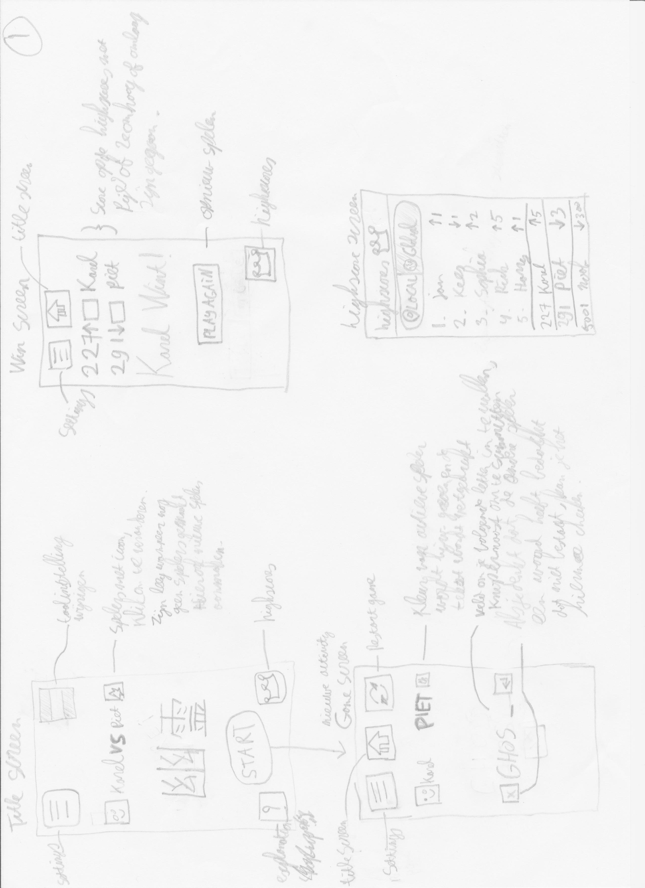
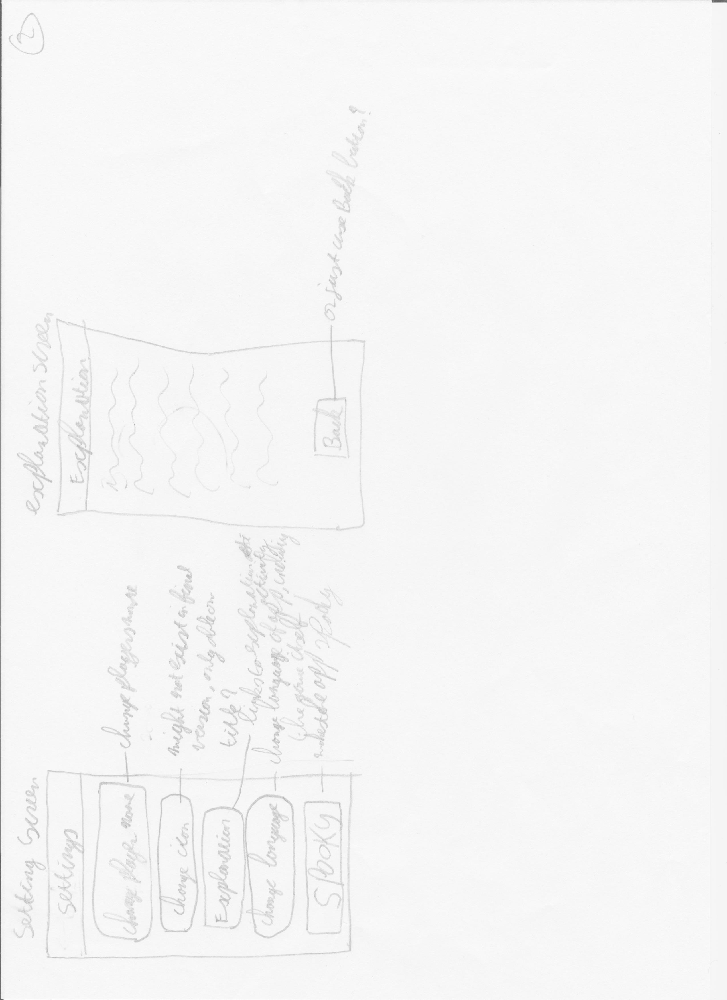
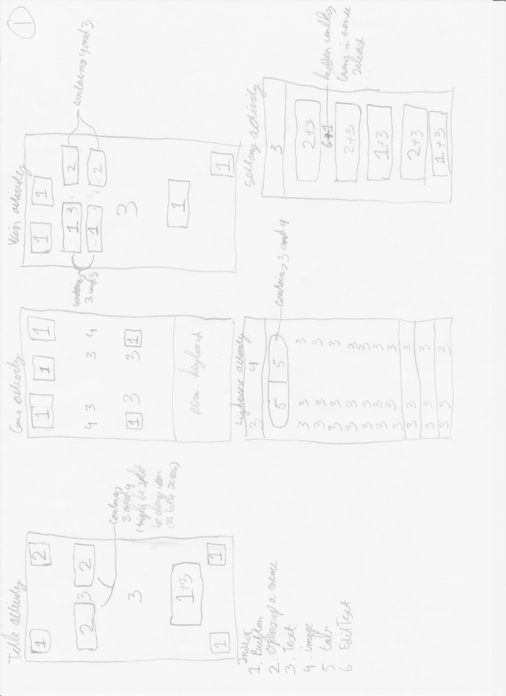
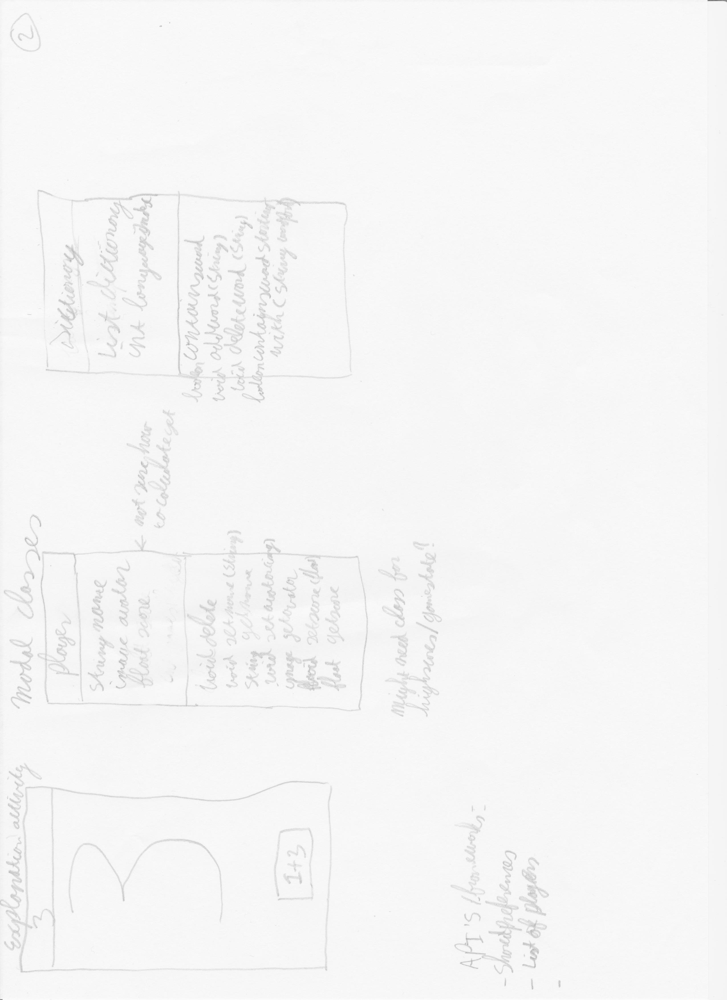

Yuurei

This is an implementation of the ghost game. In this game, two players play a word game against each other. One player starts with one letter and the other tries to think of a letter that does not complete a word, but is part of a bigger word.

Features in this app:

<ol>
<li>Music is played during duration of the app</li>
<li>Player names can be changed</li>
<li>Has a "spooky mode" which makes the app scarier</li>
<li>User has an icon besides their names while playing (and this is possible to be changed</li>
</li>The app is explained in a new activity</li>
</ol>  

Now follows the controller sketches with more emphasis on each individual screen along with specific controls, instead of interaction between activities.

